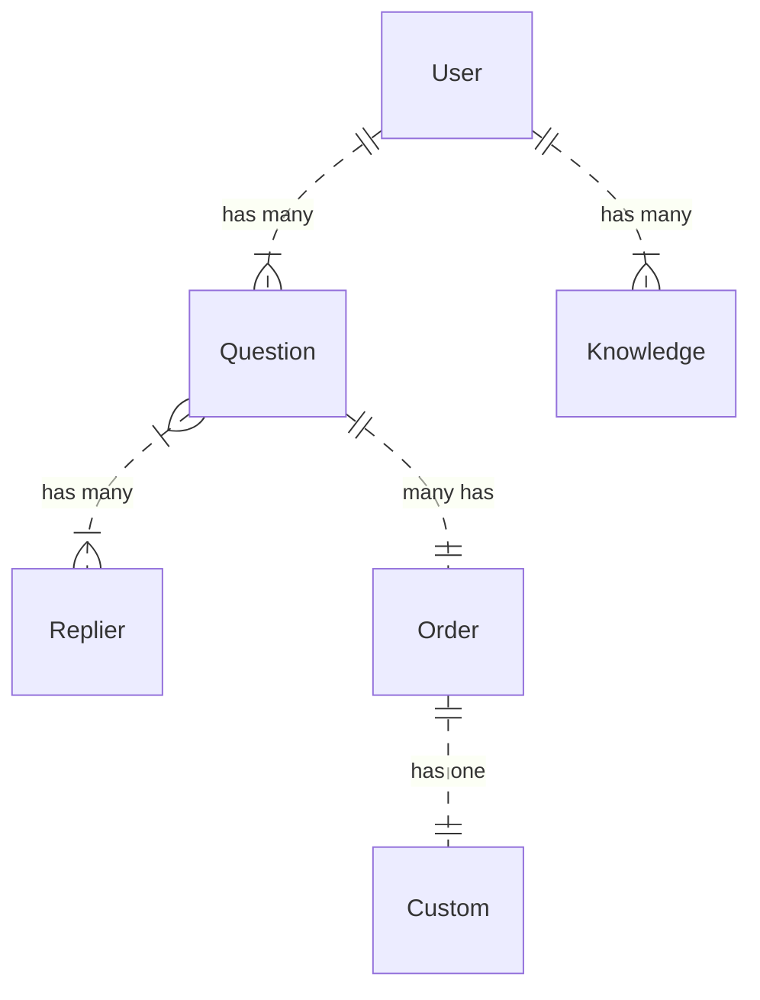

# fastapicli 
easy tool for fastapi peewee jwt


## How to init project
fastapi_init.py projectname

## How to create api and logic in project
```
cd {projectname}/app
fastapi_api.py -m Project -n Label 

```


